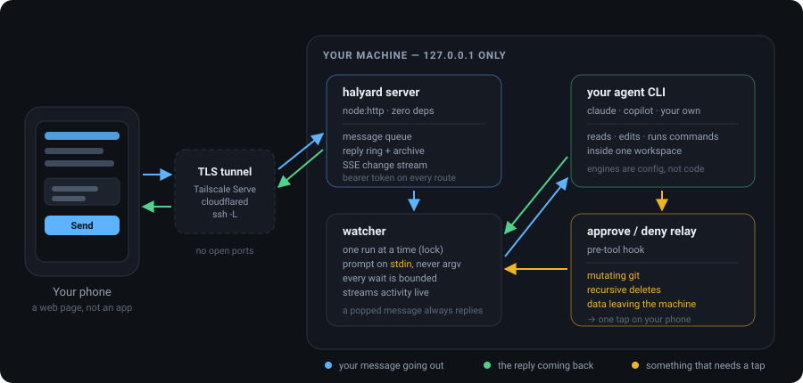
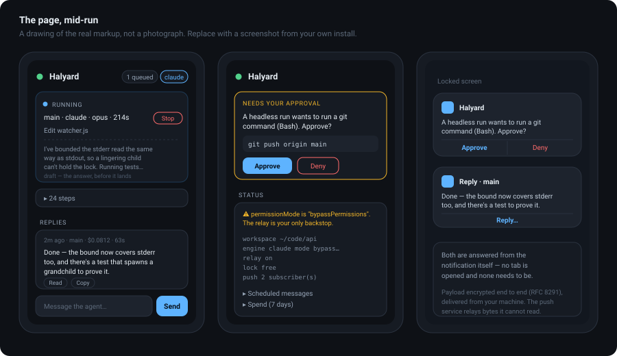
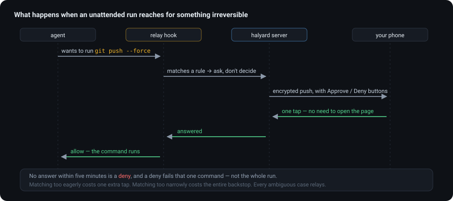

<div align="center">

# Halyard

**Drive your coding agent from your phone.**

Queue work from anywhere, watch it happen live, approve the risky bits with one tap.
Self-hosted, zero dependencies, no open ports, runs on Windows, macOS and Linux.

[](https://nodejs.org)
[](package.json)
[](#install)
[](LICENSE)



</div>

---

## What it is

A tiny local service that turns your phone into a front end for the coding agent already
installed on your machine. You send it a message; it runs `claude` (or `copilot`, or a
script of your own) in a directory you chose, streams what the agent is doing back to your
screen, and pushes the answer to you when it lands.

The agent runs **on your machine, as you, in your files**. Halyard never sends your code
anywhere. The only thing that leaves is whatever your agent's own provider already sees.

```
you, on a train                     your desk, at home
┌───────────────────┐               ┌────────────────────────────┐
│ "the deploy is    │  ──tunnel──▶  │ claude reads the logs,      │
│  failing, look    │               │ finds it, writes the fix,   │
│  at prod logs"    │  ◀────────    │ asks you before it pushes   │
└───────────────────┘               └────────────────────────────┘
```

## Why you might want it

- **Your best ideas do not happen at your desk.** Queue the work when you think of it.
- **Long runs are not worth watching.** Send it, put the phone away, get a push when it's done.
- **Standing jobs.** "Every weekday at 08:30, check for dependency advisories and open a PR."
- **A leash that actually works.** An agent running unattended will eventually reach for
  `git push --force` or `rm -rf`. Halyard stops and asks you first, on your lock screen.

---

## Install

**Requires:** Node 18.17+, and an agent CLI you already use.

<details open>
<summary><b>macOS / Linux</b></summary>

```sh
curl -fsSL https://raw.githubusercontent.com/jakoreilly/Halyard/main/scripts/install.sh | sh
```
</details>

<details>
<summary><b>Windows</b></summary>

```powershell
irm https://raw.githubusercontent.com/jakoreilly/Halyard/main/scripts/install.ps1 | iex
```
</details>

<details>
<summary><b>From source, anywhere</b></summary>

```sh
git clone https://github.com/jakoreilly/Halyard && cd Halyard
node bin/halyard.js setup
node bin/halyard.js start
```
No `npm install` step. There is nothing to install.
</details>

Then:

```sh
halyard setup          # config, token, push keys
halyard start          # server + watcher
halyard doctor         # what's configured, reachable, and risky
```

`start` prints a URL with a token in it. Open that on your phone and add it to your home
screen — it is a PWA, so it gets an icon and behaves like an app.



---

## What you can do with it

| | |
|---|---|
| **Send work** | A message goes on a queue and starts immediately. Pick the engine, the model, and which thread it belongs to. |
| **Watch it happen** | A live activity line, an expandable step-by-step transcript, and the model's own prose as a **draft answer** — so a twenty-minute run reads as answered minutes before it finishes. |
| **Approve the dangerous parts** | Mutating git, recursive deletes and anything sending data off the machine stop and ask. Answer from the notification without opening anything. |
| **Schedule and repeat** | "In an hour", "tomorrow 07:00", "every weekday 08:30". Repeats survive restarts and don't drift across daylight saving. |
| **Keep threads** | Each thread owns a real agent session plus a rolling summary, so `work` and `homelab` don't bleed into each other. |
| **Search everything** | Every reply is archived to disk permanently and searchable, not just the last thirty. |
| **See what it cost** | Per-run cost and duration, rolled up by day, thread and model. |
| **Get artifacts back** | The agent writes a report to `artifacts/`; you get a tappable link. |
| **Retry a lost message** | If a run dies, the message it ate comes back with one tap. |
| **Read it aloud** | On-device speech, for when you're walking. |

### Worked examples

<details>
<summary><b>"Fix the failing build"</b></summary>

```
you    → the CI build on main is red, have a look and fix it
        [engine: claude · model: opus · thread: work]

phone  ⟳ Run gh run view --log-failed
       ⟳ Read src/parser.ts
       ⟳ Edit src/parser.ts
       ⟳ Run npm test
       ⚠ A headless run wants to run a git command (Bash). Approve?
         git commit -am "fix: handle empty input in parser"     [Approve] [Deny]

you    → *taps Approve on the lock screen*

phone  ✓ Fixed — the parser threw on an empty payload, which only the
         nightly job produces. Added a guard and a test. Committed, not
         pushed; say the word.
         ─────────────────────────
         Edited 2 files · Git: 1 command · $0.0641 · 96s · 8 turns
```
</details>

<details>
<summary><b>A standing job</b></summary>

```
you    → check every dependency for new advisories, summarise anything
         that affects us, and write it to artifacts/advisories.html
        [when: Weekdays 08:30]
```
It runs on schedule whether or not the page is open, whether or not the phone is
on. A repeat re-queues itself when it is popped, so one failed run does not
silently end a standing job.
</details>

<details>
<summary><b>Reply straight from the notification</b></summary>

You get a reply, you have one follow-up, you never open the page:

```
🔔 Reply · work
   Fixed — the parser threw on an empty payload…
   [ Reply… ]  →  "now push it and open a PR"
```
The follow-up lands in the same thread, on the same engine.
</details>

---

## Safety

This is the part to read before you run it. Halyard hands an agent a leash, and the whole
design question is how long that leash is.



**Defaults are conservative.** Out of the box Halyard binds `127.0.0.1` only, scopes the
agent to a single workspace directory you chose, uses your agent's own permission rules,
and turns the relay on.

**`halyard doctor` names every loosening.** Bound to a LAN address, running in a bypass
permission mode, a workspace that contains your home directory, an engine with no hook —
each is a legitimate choice for somebody and each prints a warning that says exactly what
it exposes. It never refuses to run in a configuration its author disagrees with.

**The relay is a real backstop, not a checkbox.** It matches mutating git, recursive
deletes and outbound data — including `sh -c "git push --force"`, `gh pr create`, and a
`curl` with the flag written before the URL, all of which are the obvious ways to walk past
a naive matcher. It deliberately matches *eagerly*: an unnecessary tap costs a second, a
missed one costs the whole thing.

**Known gap, stated plainly:** the relay is a pre-tool hook, and not every agent CLI has
one. `halyard doctor` and the phone's engine picker both label an engine that cannot be
supervised. Do not read "the relay covers this" as true of every engine.

Full detail, including the threat model and what Halyard explicitly does **not** protect
against: **[SECURITY.md](SECURITY.md)**.

---

## Reaching it from outside

Halyard binds loopback. It is meant to be reached through a tunnel that handles TLS and
device identity, not by opening a port:

| | |
|---|---|
| **Tailscale Serve** *(recommended)* | `tailscale serve --bg 4545` — HTTPS on a private tailnet name, nothing exposed publicly |
| **Cloudflare Tunnel** | `cloudflared tunnel --url http://127.0.0.1:4545` |
| **SSH forward** | `ssh -L 4545:127.0.0.1:4545 you@machine` |

HTTPS is not decoration here: **Web Push needs a secure context.** Over plain HTTP the
browser's `PushManager` does not exist and you drop to in-page alerts only. The page tells
you which tier is actually in force.

See **[docs/REMOTE-ACCESS.md](docs/REMOTE-ACCESS.md)**.

---

## Configuration

Everything lives in one JSON file in your OS data directory — nothing in the repo, so
`git pull` never touches your install and a fork inherits no paths that only made sense on
someone else's machine.

```
Linux    ~/.local/state/halyard/        (or $XDG_STATE_HOME/halyard)
macOS    ~/Library/Application Support/halyard/
Windows  %LOCALAPPDATA%\halyard\
```

```jsonc
{
  "host": "127.0.0.1",
  "port": 4545,
  "workspace": "/home/you/code/api",     // the ONLY directory the agent may touch
  "defaultEngine": "claude",
  "permissionMode": "default",
  "relay": { "enabled": true, "rules": ["git", "destructive-fs", "network-egress"] },
  "push": { "enabled": true, "subject": "mailto:you@example.com" }
}
```

Override any of it with `HALYARD_*` environment variables or CLI flags. A different install
on the same machine is just `--data-dir`. Full reference:
**[docs/CONFIGURATION.md](docs/CONFIGURATION.md)**.

### Bring your own agent

An engine is **data, not code**. Adding one is a config entry:

```jsonc
"engines": {
  "aider": {
    "label": "Aider",
    "command": "aider",
    "args": ["--no-pretty", "--yes", "--message-file", "-"],
    "stream": "text"
  }
}
```

`stream` picks the output dialect: `claude-json`, `copilot-json`, or `text` for anything
that reads a prompt on stdin and prints an answer. Argument pairs whose value is empty are
dropped whole, so one template covers "no model selected" and "no session to resume".
**[docs/ENGINES.md](docs/ENGINES.md)**.

---

## Commands

```
halyard setup                 create config, token and push keys
halyard start                 server + watcher (the normal command)
halyard serve                 server only
halyard watch                 one watcher pass (for cron / systemd timer)
halyard doctor                what is configured, reachable and risky
halyard token [--url]         print the token, or the full link
halyard hook-config           agent hook config for the approve/deny relay
halyard install-service       write a systemd unit / launchd plist / scheduled task
```

`install-service` **writes** the unit and prints the one command that registers it. It never
registers it for you — that is a system-wide change that outlives the process making it.

---

## How it works

Four moving parts and one rule each.

**The server** (`src/server.js`) is `node:http` and nothing else. It holds a queue in one
direction and a reply ring in the other, persists both so a restart mid-conversation
doesn't silently swallow your message, and publishes a **change stream** (`/api/events`)
that carries only version counters — the page reacts by calling the same poll functions it
always had. That one change removed about 1,500 requests an hour.

**The watcher** (`src/watcher.js`) pops one message, spawns the agent, and reads its stdout
a line at a time. Three invariants it will not give up:

- The prompt goes in on **stdin, never as an argument**. Passing a multi-paragraph prompt
  as argv works until it contains a quote, at which point some platforms strip it and split
  on the next whitespace — the model answers a truncated question and nothing reports an
  error.
- **A popped message always produces a reply.** The pop is destructive with no re-queue, so
  every path after it either answers or reports a failure you can retry with one tap.
- **Every wait is bounded.** A grandchild that inherited the agent's stdout holds the pipe
  open after the agent exits; an unbounded read there hangs forever holding the run lock.
  `test/e2e.js` spawns exactly that grandchild and asserts the run still returns.

**The relay hook** (`hooks/permission-relay.js`) runs before a tool call, matches it against
three rule families, and asks your phone. It arms only for unattended runs — in an
interactive session it is not a backstop, it is an obstacle.

**The page** (`public/index.html`) is one file, served fresh on every request, no build step.

---

## What this is not

- **Not a hosted service.** There is no Halyard cloud. If your machine is off, nothing runs.
- **Not multi-user.** One token, one operator. It is a remote control for your own computer.
- **Not a sandbox.** It scopes the agent to a workspace and gates dangerous commands; it
  does not contain a determined process. If that is your threat model, run the agent in a
  container and point Halyard at that.
- **Not a replacement for your terminal.** It is for the work you'd otherwise not start
  until you got home.

---

## Development

```sh
node test/smoke.js     # 43 checks: routes, guards, crypto, parsers — no live install touched
node test/e2e.js       # a real server + watcher driving a fake agent CLI
npm test               # both
npm run check          # syntax gate, including the page's inline script
```

The suites run against a throwaway data directory on an ephemeral port, so you can run them
while the bridge is serving your phone.

The bias in the tests is towards pinning things that fail **silently** — a path-traversal
guard, a log allow-list, a query default that read "absent" as "zero", a service worker
whose install rejected and left last month's worker running, a push payload a push service
accepts with a 201 and never delivers. Each of those has a test whose comment says which
bug it is guarding.

**[CONTRIBUTING.md](CONTRIBUTING.md)** · MIT licensed.

---

<div align="center">
<sub>A halyard is the line you use to raise something up the mast. You stay on deck; the work happens up top.</sub>
</div>
